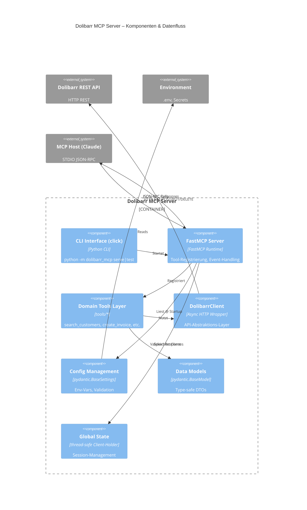
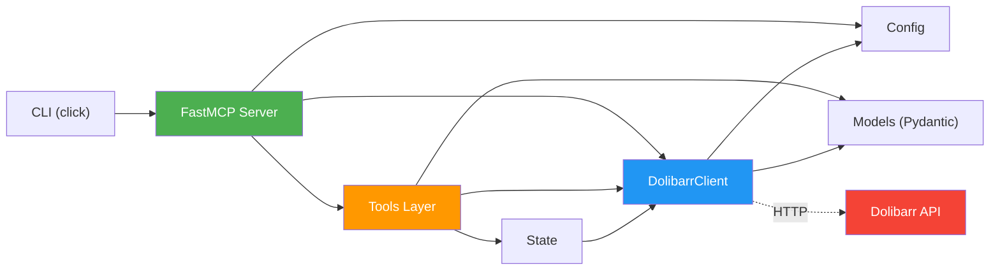

# Bausteinsicht & Komponentenarchitektur (Building Blocks)

**Referenz:** arc42 Kapitel 4 (mit C4 Notation)  
**Status:** MVP v1.1.0

---

## 1. C4 Level 2 – Hauptkomponenten



---

## 2. Komponenten im Detail

### 2.1 **CLI Interface** (`__main__.py` + `cli.py`)
**Rolle:** Einstiegspunkt für Benutzer

```python
python -m dolibarr_mcp serve      # Starte MCP Server
python -m dolibarr_mcp test       # Teste Verbindung zu Dolibarr
```

**Verantwortlichkeiten:**
- Argument-Parsing via `click`
- Environment-Loading (`.env`)
- Server-Startup & Shutdown
- Status-Messaging an User

**Schnittstellen:**
- Input: CLI Args + .env
- Output: STDIO (User-Messages, Logs)
- Abhängigkeiten: `Config`, `FastMCP Server`

---

### 2.2 **FastMCP Server** (`server.py`)
**Rolle:** MCP-Protokoll-Handler, Tool-Registrierung

**Verantwortlichkeiten:**
- MCP STDIO-Transport starten
- Tools registrieren (aus allen Tool-Modulen)
- Lifespan-Ereignisse (Startup/Shutdown)
- Session-Verwaltung über `DolibarrClient`

**Beispiel-Code:**
```python
@asynccontextmanager
async def server_lifespan(server: FastMCP):
    # Startup: Create & test client session
    client = DolibarrClient(config)
    await client.start_session()
    set_client(client)  # Global state
    
    yield  # Server runs
    
    # Shutdown: Cleanup
    await client.close_session()

mcp = FastMCP("dolibarr-mcp", lifespan=server_lifespan)
register_proposal_tools(mcp)    # Register all tool modules
register_customer_tools(mcp)
# ... etc
```

**Schnittstellen:**
- Input: `Config`, Tool-Module
- Output: MCP STDIO (JSON-RPC)
- Abhängigkeiten: `fastmcp`, `DolibarrClient`, Tool-Module

---

### 2.3 **Domain Tools Layer** (`tools/*.py`)
**Rolle:** Business-Logik für jede Domain (Customers, Invoices, etc.)

**Struktur (pro Domain):**
```
tools/
  ├── customers.py      # search_customers, create_customer, update_customer, etc.
  ├── invoices.py       # create_invoice, get_invoice, update_invoice, etc.
  ├── proposals.py      # get_proposal, create_proposal, etc.
  ├── products.py       # search_products, get_product, update_product, etc.
  ├── projects.py       # search_projects, create_project, etc.
  ├── orders.py         # create_order, get_order, etc.
  ├── contacts.py       # create_contact, get_contact, update_contact, etc.
  ├── users.py          # get_user, create_user, etc.
  └── system.py         # get_status, test_connection
```

**Beispiel: `customers.py`**
```python
def register_customer_tools(server: FastMCP):
    """Register all customer management tools."""
    
    @server.call_tool()
    async def search_customers_by_name(name_pattern: str, limit: int = 10) -> str:
        """Search customers by name (server-side filtered)."""
        client = get_client()
        customers = await client.get_thirdparties(
            sqlfilters=f"name LIKE '%{name_pattern}%'",
            limit=limit
        )
        return json.dumps(customers, default=str)
    
    @server.call_tool()
    async def create_customer(name: str, email: str | None = None, **kwargs) -> str:
        """Create a new customer."""
        client = get_client()
        customer_data = {"name": name, **({"email": email} if email else {}), **kwargs}
        result = await client.create_thirdparty(customer_data)
        return json.dumps(result, default=str)
```

**Konventionen:**
- **Spezialisierte Tools:** `search_X_by_Y`, nicht `get_all_X`
- **Type Hints:** Alle Parameter & Return-Types dokumentiert
- **Docstrings:** Google-Style, erklären Parameter & Rückgabe
- **Error Handling:** Aussagekräftige Exceptions (Pydantic Validation, DolibarrAPIError)
- **JSON Output:** Alle Responses als JSON-Strings (MCP-Konvention)

**Schnittstellen:**
- Input: User-Parameter (Strings, Numbers)
- Output: JSON-String mit strukturierten Daten
- Abhängigkeiten: `DolibarrClient`, `models.py`

---

### 2.4 **DolibarrClient** (`dolibarr_client.py`)
**Rolle:** Async HTTP Wrapper um Dolibarr REST API

**Verantwortlichkeiten:**
- Session-Management (aiohttp.ClientSession)
- Request-Building (Headers, Payload-Validation)
- Response-Parsing & Error-Handling
- CRUD-Operationen auf API-Ressourcen

**API-Struktur:**
```python
class DolibarrClient:
    # Users
    async def get_user(user_id: int) -> dict
    async def create_user(data: dict) -> int
    async def get_users(limit=50) -> list[dict]
    
    # Customers (thirdparties)
    async def get_thirdparty(id: int) -> dict
    async def get_thirdparties(sqlfilters="", limit=50) -> list[dict]
    async def create_thirdparty(data: dict) -> int
    async def update_thirdparty(id: int, data: dict) -> bool
    
    # Products
    async def search_products(sqlfilters="", limit=50) -> list[dict]
    async def get_product(id: int) -> dict
    async def create_product(data: dict) -> int
    
    # Invoices, Orders, Proposals, Projects, Contacts, etc.
    # Selbe Pattern: get_X, get_Xs, create_X, update_X, delete_X
    
    # System
    async def get_status() -> dict
    async def raw_api(path: str, method: str, data: dict | None) -> dict
```

**Datenfluss (Beispiel: `search_products`):**
```
User Tool Call
    ↓ (name_pattern="widget")
Tools/products.py: search_products_by_name(name_pattern)
    ↓
DolibarrClient.search_products(sqlfilters=f"ref LIKE '%{name_pattern}%'")
    ↓
Build Request
    ├─ Method: GET
    ├─ URL: https://dolibarr/api/index.php/products
    ├─ Params: sqlfilters=..., limit=10
    └─ Headers: DOLAPIKEY, Content-Type
    ↓
HTTP Request → Dolibarr
    ↓
Parse Response
    ├─ Status 200: [{"id": 1, "ref": "WIDGET-001"}, ...]
    └─ Status 404/500: Raise DolibarrAPIError
    ↓
Validate with Pydantic (ProductResult[])
    ↓
Return to Tool
    ↓
JSON Serialize & Return to Claude
```

**Schnittstellen:**
- Input: Resource ID, Filter-Dict, Data-Payload
- Output: Parsed Dict/List (vor Pydantic-Validation)
- Abhängigkeiten: `aiohttp`, `config.py`, `models.py`

---

### 2.5 **Config Management** (`config.py`)
**Rolle:** Umgebungsvariablen & Settings-Validierung

**Verantwortlichkeiten:**
- .env File Loading (via `python-dotenv`)
- Pydantic-Validierung der Settings
- Alias-Support (DOLIBARR_URL, DOLIBARR_SHOP_URL, etc.)
- Placeholder-Detection (warnt vor "your_api_key")

**Struktur:**
```python
class Config(BaseSettings):
    dolibarr_url: str           # Normalisiert mit /api/index.php
    dolibarr_api_key: str       # Validiert (keine Placeholder)
    log_level: str = "INFO"     # Optional
    
    @field_validator("dolibarr_url")
    def validate_dolibarr_url(cls, v: str) -> str:
        # Normalisierung: abc.com → abc.com/api/index.php
        # Validierung: Must be HTTPS in production
        
    @field_validator("dolibarr_api_key")
    def validate_dolibarr_api_key(cls, v: str) -> str:
        # Check: Not placeholder, not empty
        # Length >= 10 (typical API key length)
```

**Schnittstellen:**
- Input: Environment-Variablen + `.env` File
- Output: Validated `Config` Instance
- Abhängigkeiten: `pydantic`, `python-dotenv`

---

### 2.6 **Data Models** (`models.py`)
**Rolle:** Pydantic DTOs für Type-Safety & Validation

**Modelle:**
```python
class ProjectSearchResult(DolibarrBaseModel):
    id: int
    ref: str
    title: str
    status: int
    # ... weitere Felder

class CustomerResult(DolibarrBaseModel):
    id: int
    name: str
    email: str | None = None
    phone: str | None = None
    status: int  # 1=Active, 0=Inactive
    # ...

class InvoiceResult(DolibarrBaseModel):
    id: int
    ref: str
    socid: int  # Customer ID
    total_ttc: Decimal  # Gross Total
    status: int
    # ...

# ... Products, Orders, Proposals, Contacts, Users, etc.
```

**Nutzung:**
```python
# In tools/customers.py
response = await client.get_thirdparties(...)
validated = [CustomerResult(**item) for item in response]  # Type-checked
return json.dumps([m.model_dump() for m in validated])
```

**Schnittstellen:**
- Input: JSON-Response von Dolibarr
- Output: Validated Pydantic Model Instance
- Abhängigkeiten: `pydantic`

---

### 2.7 **Global State** (`state.py`)
**Rolle:** Thread-safe Speicher für `DolibarrClient` Session

**Verantwortlichkeiten:**
- Speichere Client-Instanz während Server-Lifespan
- Bereitstellung über `get_client()` Funktion
- Cleanup bei Shutdown

**Implementierung:**
```python
_client: DolibarrClient | None = None
_lock = threading.Lock()

def set_client(client: DolibarrClient | None) -> None:
    global _client
    with _lock:
        _client = client

def get_client() -> DolibarrClient:
    with _lock:
        if not _client:
            raise RuntimeError("Client not initialized")
        return _client
```

**Schnittstellen:**
- Input: `DolibarrClient` Instance (from server.py)
- Output: `DolibarrClient` Instance (to tools/*.py)
- Abhängigkeiten: `threading`

---

## 3. Datenfluss – Beispiel: "Create Invoice"

```
Claude: "Create an invoice for customer #42 with 2 items"
    ↓
MCP Call: tools/call(name="create_invoice", args={socid: 42, lines: [...]})
    ↓
Server.create_invoice(socid: int, lines: list[dict], ...):
    ├─ Validate Input (Pydantic InvoiceCreateRequest)
    ├─ Get Client from state
    ├─ Call client.create_invoice(data)
    │   ├─ Build HTTP POST /invoices
    │   ├─ Serialize Payload (JSON)
    │   ├─ Send Request with DOLAPIKEY header
    │   ├─ Parse Response
    │   └─ Return {id: 123, ref: "INV-00123", ...}
    ├─ Validate with InvoiceResult
    └─ Return JSON string
    ↓
JSON Response: {"id": 123, "ref": "INV-00123", "total_ttc": 1000.00}
    ↓
Claude reads response and continues conversation
```

---

## 4. Schichtenarchitektur

```
┌──────────────────────────────────────────────────────┐
│ PRESENTATION LAYER (MCP Clients)                     │
│ - Claude Desktop                                      │
│ - Other MCP-aware Tools                              │
└────────────────────────────────────────────────────┬─┘
                  ↕ JSON-RPC STDIO
┌────────────────────────────────────────────────────┴─┐
│ SERVER LAYER (FastMCP)                              │
│ - Tool Registration                                  │
│ - STDIO Transport Handling                           │
│ - Lifespan Management                                │
└────────────────────────────────────────────────────┬─┘
                      ↕
┌────────────────────────────────────────────────────┴─┐
│ DOMAIN LAYER (tools/*)                              │
│ - Business Logic: search_*, create_*, update_*      │
│ - Field Validation & Data Transformation            │
│ - Error Mapping (API → MCP Errors)                  │
└────────────────────────────────────────────────────┬─┘
                      ↕
┌────────────────────────────────────────────────────┴─┐
│ ADAPTER LAYER (DolibarrClient)                      │
│ - HTTP Request Building                             │
│ - Response Parsing & Validation (Pydantic)          │
│ - Session & Timeout Management                      │
│ - Error Handling (DolibarrAPIError)                 │
└────────────────────────────────────────────────────┬─┘
                      ↕ HTTP REST
┌────────────────────────────────────────────────────┴─┐
│ EXTERNAL SYSTEM (Dolibarr API)                      │
│ - /users, /thirdparties, /products, /invoices, ...  │
└──────────────────────────────────────────────────────┘
```

---

## 5. Projektstruktur (Ordner & Dateien)

```
dolibarr-mcp/
├── src/dolibarr_mcp/                 # Main Package
│   ├── __init__.py                   # Package Version
│   ├── __main__.py                   # CLI Entry Point (python -m)
│   ├── cli.py                        # click Commands (serve, test)
│   ├── config.py                     # Pydantic Settings
│   ├── server.py                     # FastMCP Server + Lifespan
│   ├── dolibarr_client.py            # Async HTTP Wrapper (716 lines)
│   ├── models.py                     # Pydantic DTOs
│   ├── state.py                      # Global Client State
│   ├── testing.py                    # Test Utilities
│   └── tools/                        # Domain-specific Tools
│       ├── __init__.py
│       ├── contacts.py               # Contact CRUD Tools
│       ├── customers.py              # Customer Search & CRUD
│       ├── invoices.py               # Invoice Management
│       ├── orders.py                 # Order Management
│       ├── products.py               # Product Search & CRUD
│       ├── projects.py               # Project Search & CRUD
│       ├── proposals.py              # Proposal Management
│       ├── system.py                 # System Info & Status
│       └── users.py                  # User Management
│
├── tests/                            # Test Suite
│   ├── __init__.py
│   ├── test_cli.py                   # CLI Command Tests
│   ├── test_config.py                # Configuration Tests
│   ├── test_dolibarr_client.py       # Client Unit Tests
│   ├── test_fastmcp_server.py        # Server Integration Tests
│   ├── test_crud_operations.py       # CRUD Operations
│   ├── test_invoice_atomic.py        # Invoice-specific Tests
│   ├── test_project_operations.py    # Project Tests
│   ├── test_proposal_operations.py   # Proposal Tests
│   ├── test_proposal_tools.py        # Proposal Tools
│   ├── test_search_tools.py          # Search Tools
│   ├── test_usf_filters.py           # SQL Filter Tests
│   └── manual/                       # Manual Testing Tools
│       ├── inspect_tool.py
│       └── verify_server.py
│
├── docs/                             # Documentation
│   ├── 02_architecture/              # Architecture Docs
│   │   ├── 00_intro_goals.md
│   │   ├── 01_context_scope.md
│   │   ├── 02_building_blocks.md     # (this file)
│   │   ├── 03_project_structure.md
│   │   ├── 04_decisions.md
│   │   ├── 05_implementation.md
│   │   └── 06_risks.md
│   ├── 04_guides/                    # User Guides
│   │   ├── quickstart.md
│   │   ├── configuration.md
│   │   ├── development.md
│   │   └── api-reference.md
│   └── 00_archive/                   # Old docs (archived)
│
├── docker/                           # Docker Assets
│   ├── Dockerfile                    # Production Image
│   └── docker-compose.yml            # Local Dev Stack
│
├── pyproject.toml                    # Project Metadata & Dependencies
├── .python-version                   # Python 3.12 / 3.13
├── .gitignore
├── README.md                         # Project Overview
└── LICENSE                           # MIT
```

---

## 6. Abhängigkeiten zwischen Komponenten



---

## 7. Fehlerbehandlungs-Strategie

### Fehlerfluss

```
Tool Call
    ↓
│ Try:
├─ Validiere Input (Pydantic)
├─ Get Client from State
├─ Call DolibarrClient.method()
│   ├─ Build HTTP Request
│   ├─ Send Request
│   └─ Parse Response
├─ Validate Response (Pydantic)
│ Catch:
├─ DolibarrAPIError (4xx/5xx)
│   └─ Return MCP Error: "API Error: {message}"
├─ ValidationError (Pydantic)
│   └─ Return MCP Error: "Invalid data: {details}"
├─ aiohttp.ClientError (Network)
│   └─ Return MCP Error: "Connection failed: {reason}"
└─ Exception (Unexpected)
    └─ Return MCP Error: "Internal error"
```

**Konkrete Error-Codes:**
- `400 Bad Request` → Validation Error im Tool
- `401 Unauthorized` → Invalid/Expired API-Key
- `403 Forbidden` → Insufficient Permissions
- `404 Not Found` → Resource doesn't exist
- `500+ Server Error` → Dolibarr Internal Error
- Network Timeout → Return with grace
- Type Mismatch → Pydantic ValidationError

---

**Autor:** Dolibarr MCP Team  
**Letzte Aktualisierung:** 2025-12-22  
**Zielgruppe:** Architekten, Entwickler, Integrations-Partner
